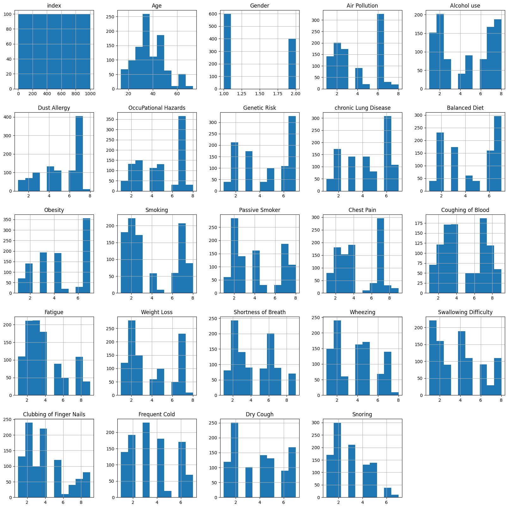

# Laporan Proyek Machine Learning
### Nama : Muhammad Irpan
### Nim : 211351094
### Kelas : Malam A

## Domain Proyek
Proyek ini bertujuan untuk melakukan prediksi dan analisis terkait kanker paru-paru. Data yang digunakan mencakup informasi tentang pasien, termasuk riwayat medis, faktor-faktor risiko, dan gejala yang dialami. Tujuan dari proyek ini adalah untuk mengembangkan model prediksi yang dapat membantu dalam menentukan tingkat keparahan kanker paru-paru pada pasien. Analisis ini bertujuan untuk memahami faktor-faktor yang berkontribusi terhadap risiko kanker paru-paru, serta memprediksi tingkat keparahan berdasarkan data pasien. Hasil dari proyek ini dapat membantu dalam diagnosis dini dan perencanaan perawatan pasien kanker paru-paru.

## Business Understanding
Sekarang, kita sedang fokus untuk memahami betul tentang penyakit kanker paru-paru. Ini melibatkan penggalian lebih dalam terkait faktor-faktor risiko yang bisa menyebabkan kanker paru-paru muncul, juga pengetahuan tentang gejala-gejala yang mungkin dialami oleh penderita. Selain itu, kita ingin tahu bagaimana informasi medis dan data pasien bisa digunakan untuk memprediksi seberapa parahnya kanker paru-paru.

Proyek ini punya tujuan besar, yaitu mengembangkan model prediksi yang sangat akurat. Model ini diharapkan bisa jadi alat yang membantu dalam mendiagnosis kanker paru-paru lebih awal dan menentukan seberapa parahnya penyakit pada pasien. Dengan melakukan analisis ini, kita berusaha memahami sejauh mana faktor-faktor risiko berpengaruh pada penyakit ini dan mencari cara efektif untuk memprediksi tingkat keparahannya berdasarkan data pasien.

### Problem Statements
- Keterbatasan Diagnosis Dini: Terdapat kendala dalam mendeteksi kanker paru-paru pada tahap awal, yang dapat mempengaruhi efektivitas pengobatan dan tingkat kesembuhan pasien.

- Kompleksitas Faktor Risiko: Faktor-faktor risiko yang berkontribusi terhadap munculnya kanker paru-paru masih belum sepenuhnya dipahami, mempersulit upaya pencegahan dan intervensi.

- Ketidakpastian Tingkat Keparahan: Penentuan tingkat keparahan kanker paru-paru yang tepat saat diagnosis seringkali menantang, sehingga menyulitkan perencanaan perawatan yang optimal.

 ### Goals
 - Tujuan dari proyek ini adalah untuk mengembangkan model prediksi yang akurat untuk menentukan tingkat keparahan kanker paru-paru pada pasien. Model ini akan digunakan untuk diagnosis dini, membantu dalam perencanaan perawatan yang lebih efektif, dan meningkatkan pemahaman tentang faktor-faktor risiko yang berkontribusi terhadap penyakit kanker paru-paru.

  ### Solution statements
Saya akan mengembangkan model prediksi untuk membantu memprediksi seberapa parah kanker paru-paru pada pasien. Model ini akan memanfaatkan informasi medis dan faktor-faktor risiko pasien dengan menggunakan algoritma Machine Learning yang disebut sebagai K-Nearest Neighbors (KNN).

  ## Data Understanding
  Pada tahap ini, kita sedang membangun dasar analisis untuk penelitian dengan merangkum dan mengidentifikasi potensi masalah dalam data yang telah dikumpulkan terkait prediksi kanker paru-paru.

  https://www.kaggle.com/datasets/thedevastator/cancer-patients-and-air-pollution-a-new-link/data

  ### Variabel-variabel pada Lung Cancer Prediction  adalah sebagai berikut:    
 1. Patient_Id = identitas Pasien = object
 2. Age = Umur Pasien = int64
 3. Gender = Jenis Kelamin Pasien = int64 
 4. Air_Pollution = Polusi Udara = int64 
 5. Alcohol_use = Alohol yang di konsumsi = int64 
 6. Dust_Allergy = Alergi Debu =  int64 
 7. OccuPational_Hazards = Bahaya Pekerjaan = int64 
 8. Genetic_Risk = Resiko Genetik = int64 
 9. chronic_Lung_Disease = Riwayat penyakit paru paru kronis = int64 
 10. Balanced_Diet = Diet seimbang pasien = int64 
 11. Obesity = Riwayat obesitas = int64 
 12. Smoking = Riwayat Merokok = int64 
 13. Passive_Smoker = Merokok Passif =  int64 
 14. Chest_Pain = Nyeri pada dada = int64 
 15. Coughing_of_Blood = Batuk berdarah = int64 
 16. Fatigue = Gejala Kelelahan = int64 
 17. Weight_Loss = Penurunan berat badan = int64 
 18. Shortness_of_Breath = Sesak nafas = int64 
 19. Wheezing = Suara saluran pernapasan = int64 
 24. Snoring = int64 
 25. Level = object
 
## Data Preparation
### Data Collection

Data ini merupakan koleksi informasi medis yang berharga yang mencakup riwayat penyakit, faktor-faktor risiko, dan gejala pasien. Data tersebut dikumpulkan dari catatan medis pasien di berbagai lembaga medis dan rumah sakit. Data ini berperan penting dalam upaya diagnosis dini dan pemahaman faktor-faktor yang berkontribusi terhadap penyakit kanker paru-paru.

### Data Discovery And Profiling
Library-library yang saya butuhkan 
``` bash
import numpy as np
import pandas as pd
import matplotlib.pyplot as plt
import seaborn as sns
import pickle
from sklearn.metrics import confusion_matrix
from sklearn.model_selection import train_test_split
from sklearn.neighbors import KNeighborsClassifier
from sklearn.preprocessing import LabelEncoder
from sklearn.metrics import classification_report
```
Cara pemanggilan dataset dan melihat 5 data paling atas
```bash
df = pd.read_csv("cancer_patient.csv")
df.head()
```
melihat type data yang digunakan
``` bash
df.info()
```
Membuat sebuah histogram dari data di dalam DataFrame.
``` bash
p = df.hist(figsize = (20,20))
```
 <br>
Pemanggilan histogram ke 2 dari data frame
``` bash
sns.displot(df, bins = 20)
```
 <br>
Lalu kita akan membuat diagram batang yang menghitung jumlah kemunculan setiap nilai pada variabel 'Level' dalam DataFrame
``` bash
sns.countplot(x = 'Level', data=df)
```
 <br>
Selanjutnya menghitung dan menampilkan jumlah frekuensi setiap nilai unik dalam kolom 'Alcohol use' dari DataFrame
``` bash
sns.countplot(x = 'Alcohol use', data=df)
```
 <br>
disini kita akan memvisualisasikan distribusi nilai dalam kolom 'Level' dari suatu DataFrame
``` bash
print(df['Level'].value_counts())
plt.pie(df.Level.value_counts(),labels=df.Level.value_counts().index,autopct='%.0f%%')
plt.show()
```
 <br>
Setelah ini kita akan melakukan preprocessing data
disini kita akan membuat variabel independen yang berisi daftar kolom independen dari DataFrame df, dengan mengabaikan kolom yang bernama 'Level', dan variabel defenden yang menyimpan string 'Level'.
``` bash
independen = [col for col in df.columns != 'Level']
defenden = 'Level'
```
Lalu kita akan mengelompokkan kolom-kolom dalam sebuah DataFrame (diasumsikan disimpan dalam variabel df) menjadi dua kategori: numerical (numerik) dan categorical (kategorikal). Setelah itu, nilai-nilai yang hilang (NaN) diisi kembali dengan nilai median untuk kolom numerik dan nilai modus untuk kolom kategorikal.
``` bash
numerical = []
catgcols = []

for col in df.columns:
    if df[col].dtype == 'float64':
        numerical.append(col)
    elif df[col].dtype == 'int64':
        numerical.append(col)
    else:
        catgcols.append(col)

for col in df.columns:
    if col in numerical:
        df[col].fillna(df[col].median(), inplace=True)
    else:
        df[col].fillna(df[col].mode()[0], inplace=True)
```
selanjutnya menghitung jumlah kemunculan setiap nilai unik dalam kolom 'Level' dari DataFrame df.
``` bash
df['Level'].value_counts()
df['Patient Id'].value_counts()
```
lalu mengubah nilai-nilai kategorikal dalam  DataFrame menjadi nilai numerik menggunakan teknik yang disebut Label Encoding.
``` bash
le = LabelEncoder()
for col in catgcols:
    df[col] = le.fit_transform(df[col])
```
mentransformasikan nilai-nilai dalam kolom 'Level' dari suatu DataFrame (df) menjadi representasi numerik.
``` bash
df['Level'] = le.fit_transform(df['Level'])
```
lalu kita simpan hasil dari processing data yang sudah lakukan dan menyimpan dalam dataset baru bernama LungCancer
``` bash
df.to_csv('LungCancer.csv')
```
setalah persiapan data selesai kita akan membuat nilai X dan Y
``` bash
X = df.drop(columns=['Level', 'index', 'Frequent Cold', 'Snoring'], axis=1)
Y = df['Level']
```
saya akan membuat data latih dan data uji dalam code ini
``` bash
x_train, x_test, y_train, y_test = train_test_split(X, Y, test_size=0.2, stratify=Y, random_state=2)
```


## Modeling
Selanjutnya membuat model yang akan di gunakan, disini saya menggunakan mode K-Nearest Neighbors (KNN).
``` bash
model1=KNeighborsClassifier(n_neighbors=3)
model1.fit(x_train,y_train)
y_pred1=model1.predict(x_test)
y_true = y_test
```
disini kita akan klasifikasi data uji yang sudah di latih dan melihat berapa akurasi yang di dapat
``` bash
score = model1.score(x_test, y_test)
print('akurasi model knn = ', score)
```
akurasi model knn =  0.855<br>
lalu kita akan melihat visualisasi hasil algoritma yang di hasilkan
``` bash
print("Confusion Matrix:")
print(confusion_matrix(y_true, y_pred1))
print("\nClassification Report:")
print(classification_report(y_true, y_pred1))
```
``` bash
cm = confusion_matrix(y_true, y_pred1)
plt.figure(figsize = (10,7))
sn.heatmap(cm, annot=True, cmap = 'viridis')
plt.title('Confusion Matrix - Test Data')
plt.xlabel('Predicted Label')
plt.ylabel('True Label')
```
Confusion Matrix:<br>
[[70    3  2]<br>
[4  60   3]<br>
[10 7   41]]<br>


## Evaluasi
Disini kita akan memprediksi tingkat keparahan kanker paru-paru berdasarkan data masukan.
``` bash
input_data = (1,7,1,3,1,5,3,4,2,2,2,2,4,2,3,1,3,7,8,6,2,7)
input_data_numpy = np.asarray(input_data)
data_reshaped = input_data_numpy.reshape(1, -1)
prediksi = model1.predict(data_reshaped)
print(prediksi)

if (prediksi[0] == 0):
    print('Keparahan Kanker Paru-Paru Pasien Berada di Tingkat Tinggi')
elif(prediksi == 2):
    print('Keparahan Kanker Paru-Paru Pasien Berada di Tingkat Sedang')
else:
    print('Keparahan Kanker Paru-Paru Pasien Berada di Tingkat Rendah')
```
Keparahan Kanker Paru-Paru Pasien Berada di Tingkat Sedang

## Deployment
 [LungCancerAPP](https://uasmesinlearning-8sj6bewzkoubqufeihbpe8.streamlit.app/)

